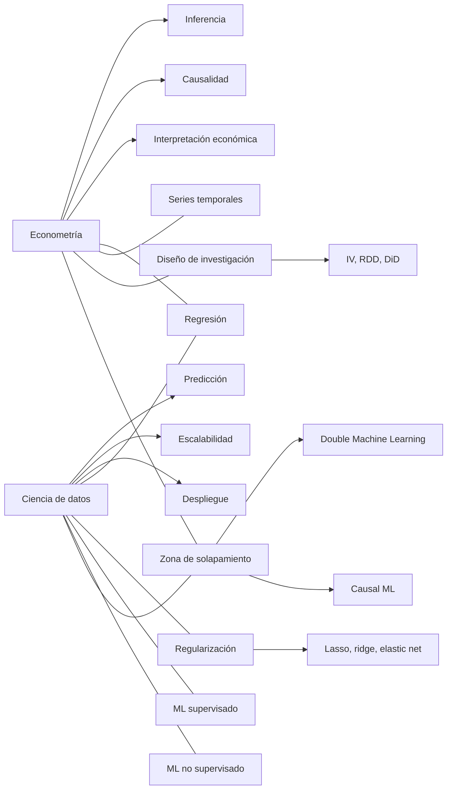

# Ciencia de datos y econometría

## Resumen ejecutivo

La diferencia más útil para una presentación divulgativa no es “la econometría usa estadística y la ciencia de datos usa algoritmos”, porque eso se queda corto. La separación más clara es otra: **la econometría nació para responder preguntas económicas con interpretación causal o estructural** —por ejemplo, “¿subir el salario mínimo reduce el empleo?” o “¿cuánto aumenta el salario con un año más de educación?”—, mientras que **la ciencia de datos se consolidó como un campo orientado a extraer valor operativo de datos a escala**, combinando estadística, programación, bases de datos, visualización, aprendizaje automático y despliegue de modelos. Dicho brutalmente: la econometría suele preguntar **“qué efecto tiene X sobre Y y bajo qué supuestos puedo creérmelo”**; la ciencia de datos suele preguntar **“qué patrón me ayuda a predecir, clasificar, segmentar o automatizar mejor”**. Pero esa frontera ya no es rígida: hoy hay un área híbrida muy fuerte —**causal machine learning** y **double machine learning**— que junta predicción flexible con inferencia causal. citeturn18search12turn13view0turn16search2turn16search7turn3search8turn20view0turn20view1

Históricamente, la econometría quedó marcada por Ragnar Frisch, la creación de la Econometric Society en 1930 y, sobre todo, por Haavelmo, que dio una base probabilística a la disciplina en 1944. La ciencia de datos, en cambio, se suele rastrear desde la llamada de John Tukey a una “ciencia del análisis de datos”, el plan de William Cleveland para ampliar la estadística hacia “data science”, y la visión de David Donoho de una “greater data science” donde computación, workflows, reproducibilidad y escalabilidad son centrales. citeturn18search16turn18search12turn13view0turn16search16turn16search19turn16search7

Para explicar esto a público no técnico, conviene usar una fórmula simple: **la econometría optimiza credibilidad causal e interpretación; la ciencia de datos optimiza utilidad predictiva y escalabilidad**. Luego añades el matiz importante: **ambas usan regresión, regularización, series temporales, validación y software común como R y Python; lo que cambia no es tanto la caja de herramientas como el criterio de éxito**. Esta distinción la sintetizan muy bien Shmueli con la separación entre explicar y predecir, Breiman con sus “dos culturas” del modelado, y Mullainathan y Spiess al situar el aprendizaje automático dentro del “toolbox” del economista aplicado. citeturn3search8turn14search4turn13view3

## Definiciones y raíces históricas

Ragnar Frisch introdujo el término **econometrics** en 1926 como una disciplina “intermedia entre matemáticas, estadística y economía” con la ambición de convertir la economía teórica en una ciencia “en sentido estricto”. Poco después, la Econometric Society se fundó en 1930, y Haavelmo dio el gran salto metodológico al sostener que el análisis econométrico debía apoyarse en teoría de la probabilidad e inferencia estadística. Ese giro es clave: desde entonces, la econometría no es solo “hacer regresiones”, sino **formular un modelo probabilístico y defender por qué sus parámetros pueden interpretarse económicamente**. citeturn0search8turn18search16turn13view0

La **ciencia de datos** no tiene un momento fundacional tan único. Tukey, en 1962, ya defendía que el análisis de datos era más amplio que la estadística matemática tradicional e incluía procedimientos para analizar datos, interpretar resultados y planificar la recolección. Cleveland, en 2001, propuso explícitamente ampliar el campo de la estadística hacia “data science”, con áreas técnicas que incluían modelos y métodos, computación con datos, pedagogía y evaluación de herramientas. Donoho, en 2017, consolidó esa narrativa: la ciencia de datos no sería solo una rama nueva de la estadística, sino un ecosistema donde **datos + computación + modelado + workflows + comunicación + reproducibilidad** forman un campo propio. citeturn16search16turn16search19turn16search7

Una definición divulgativa, pero rigurosa, sería esta. **Econometría:** aplicación de métodos estadísticos y probabilísticos a datos económicos para estimar relaciones, contrastar hipótesis y extraer efectos causales o estructurales con interpretación económica. **Ciencia de datos:** disciplina interdisciplinaria que usa estadística, programación, aprendizaje automático y gestión de datos para describir, predecir, automatizar y apoyar decisiones en problemas reales. La primera pone más peso en **identificación e inferencia**; la segunda, en **predicción, generalización y pipeline end-to-end**. citeturn13view0turn25view3turn3search8turn16search7turn20view5

### Timeline mínimo para una diapositiva

> **1926** — Frisch acuña “econometrics”  
> **1930** — Nace la Econometric Society  
> **1944** — Haavelmo publica *The Probability Approach in Econometrics*  
> **1962** — Tukey publica *The Future of Data Analysis*  
> **2001** — Cleveland formula *Data Science: An Action Plan*; Breiman publica *The Two Cultures* y *Random Forests*  
> **2010** — Shmueli distingue formalmente entre explicar y predecir  
> **2017** — Donoho publica *50 Years of Data Science*; Mullainathan y Spiess integran ML al enfoque econométrico aplicado  
> **2017–2019** — Double machine learning y causal ML se vuelven puente explícito entre ambos mundos. citeturn18search12turn18search16turn13view0turn16search16turn16search19turn14search4turn14search1turn3search8turn16search7turn13view3turn20view1turn20view0turn8search7



El gráfico resume la foto actual: no son dos tribus incomunicadas, sino dos tradiciones con prioridades distintas y una intersección cada vez más grande. citeturn13view3turn8search7turn20view0turn20view1turn13view19

## Qué preguntas intentan responder y bajo qué filosofía trabajan

La diferencia filosófica más potente la formuló Galit Shmueli: **explicar no es lo mismo que predecir**. Un modelo puede servir para interpretar mecanismos causales sin ser el mejor predictor; y puede predecir muy bien sin revelar una estructura causal creíble. La econometría, sobre todo en su versión aplicada moderna, se alinea más con el lado explicativo-causal; la ciencia de datos, con el lado predictivo-operativo. Leo Breiman reforzó esto al hablar de dos culturas: la del **data model**, que parte de un mecanismo estocástico relativamente especificado, y la del **algorithmic model**, que trata el mecanismo generador como algo en gran medida desconocido y deja que el algoritmo capture patrones. citeturn3search8turn14search4

En econometría, muchas preguntas típicas son: “¿cuál es el efecto causal de una política?”, “¿qué elasticidad tiene la demanda?”, “¿qué parte del crecimiento explican capital y tecnología?”, “¿funcionó esta reforma tributaria?”. Por eso la disciplina pone tanto peso en **identificación**, **supuestos institucionales o de diseño**, y **parámetros con significado económico**. Heckman resume bien esta orientación cuando dice que los economistas se centran en la causalidad desde la perspectiva de la evaluación de políticas; Angrist y Pischke, todavía más directo, dicen que la inferencia causal “siempre ha sido el juego” en econometría aplicada. citeturn17search15turn25view3

En ciencia de datos, las preguntas típicas son: “¿quién va a dejar de pagar?”, “¿qué clientes son similares?”, “¿qué producto conviene recomendar?”, “¿qué ventas esperaré la próxima semana?”, “¿qué transacción es anómala?”, “¿cómo automatizo una parte del proceso?”. Aquí el éxito se mide menos por el significado de un coeficiente y más por **error fuera de muestra**, **AUC**, **F1**, **MAE**, **recall**, robustez operacional y capacidad de integrarse en un producto o proceso. El pipeline importa casi tanto como el modelo. citeturn24view2turn24view3turn25view8turn13view6

### Tabla comparativa por dimensiones

| Dimensión | Econometría | Ciencia de datos |
|---|---|---|
| Pregunta dominante | “¿Qué efecto tiene X sobre Y?”; “¿puedo interpretar causalmente este parámetro?” citeturn25view3turn17search15 | “¿Puedo predecir, clasificar, segmentar o automatizar bien?” citeturn3search8turn24view2 |
| Criterio de éxito | Identificación creíble, inferencia válida, interpretación económica, robustez a supuestos. citeturn13view0turn25view3turn17search15 | Rendimiento fuera de muestra, escalabilidad, utilidad operativa, mantenimiento del pipeline. citeturn24view2turn24view3turn25view8 |
| Filosofía del modelado | Más cerca del **data model**: especificar una relación probabilística y defender supuestos. citeturn14search4turn13view0 | Más cerca del **algorithmic model**: capturar patrones útiles sin exigir una forma estructural fuerte. citeturn14search4turn16search7 |
| Tipo de supuestos | Exogeneidad, exclusión, continuidad, tendencias paralelas, ignorabilidad, forma funcional, diseño muestral. citeturn25view3turn17search15turn21search11 | Representatividad del entrenamiento, estabilidad del entorno, calidad de etiquetas, ausencia de fuga de información, métrica adecuada. citeturn24view3turn13view13turn15search2 |
| Validación | Tests de hipótesis, intervalos de confianza, errores estándar, placebos, falsificaciones, checks de robustez. citeturn25view4turn25view3turn17search16 | Train/validation/test, cross-validation, tuning de hiperparámetros, curvas de aprendizaje, métricas de scoring. citeturn24view2turn24view3 |
| Relación con la teoría | Alta: la teoría económica ayuda a decidir variables, signos esperados, mecanismos e interpretación. citeturn18search12turn25view4 | Variable: puede usar mucha teoría de dominio, pero también funcionar de manera más pragmática y orientada a tarea. citeturn16search7turn25view8 |
| Interpretabilidad | Suele valorarse mucho; coeficientes y efectos marginales importan. citeturn25view3turn21search18 | Importa, pero a menudo compite con precisión; en contextos de alto riesgo se recomienda preferir modelos interpretables si rinden parecido. citeturn25view2turn13view13 |
| Producto final típico | Paper, informe causal, evaluación de política, estimación de elasticidades, pronóstico macro/financiero interpretable. citeturn17search15turn13view0turn13view11 | Dashboard, API, sistema de recomendación, scoring, detección de anomalías, forecast automatizado. citeturn25view8turn13view6turn20view3 |
| Relación actual | Cada vez incorpora ML flexible para selección, heterogeneidad y causalidad. citeturn20view0turn20view1turn8search7 | Cada vez incorpora inferencia causal, experimentación y restricciones de interpretabilidad. citeturn17search5turn25view2turn20view0 |

Lo más importante de esta tabla para una audiencia general es evitar la caricatura. **Econometría no es “regresión vieja”** y **ciencia de datos no es “caja negra cool”**. La primera también predice; la segunda también puede inferir causalidad. Lo que cambia es **qué se prioriza cuando trade-offs inevitables aparecen**. citeturn3search8turn13view3turn20view0

## Métodos, herramientas y flujos de trabajo

En econometría, el núcleo clásico sigue siendo muy reconocible: regresión lineal, variables instrumentales, diferencias en diferencias, discontinuidad en regresión, panel de datos, máxima verosimilitud, GMM, series temporales tipo ARIMA/VAR y contrastes de hipótesis. Los manuales introductorios de Stock y Watson y Wooldridge siguen siendo referencia porque combinan teoría con preguntas reales y, además, incorporan capítulos sobre big data o sobre cómo las aplicaciones deben guiar la teoría. citeturn25view4turn20view7turn21search4

En ciencia de datos, el repertorio estándar incluye **aprendizaje supervisado** —regresión, clasificación, árboles, random forests, boosting, redes neuronales— y **no supervisado** —clustering, reducción de dimensión, detección de anomalías, factorizaciones—. La propia guía de scikit-learn organiza el campo así y añade un bloque central de **selección y evaluación de modelos**, con validación cruzada, tuning de hiperparámetros y métricas de scoring. citeturn13view5turn24view2turn24view3

La regularización es una zona de contacto brutal entre ambos mundos. El artículo original de Tibshirani sobre **lasso** mostró cómo imponer una penalización \(L_1\) puede producir modelos más parsimoniosos e interpretables. Después, glmnet popularizó rutas de regularización eficientes para lasso, ridge y elastic net; y software muy usado por economistas, como Stata, terminó incorporando lasso tanto para predicción como para inferencia sobre variables de interés mientras se seleccionan controles. citeturn13view18turn8search13turn13view19

En series temporales, la econometría clásica se apoya mucho en AR, ARMA, ARIMA, VAR, cointegración y modelos de cambio de régimen; statsmodels y los textos de Hyndman y Athanasopoulos siguen siendo entradas muy sólidas para esa tradición. La ciencia de datos añade modelos basados en árboles, boosting y deep learning —por ejemplo LSTM— cuando el objetivo principal es ganar precisión predictiva en contextos complejos. Lo inteligente en una presentación es rematar con esta idea: **en forecasting, la pregunta “¿quién gana?” depende del horizonte, la calidad de datos, el tamaño muestral, la estabilidad del proceso y el costo del error, no de una ideología metodológica**. citeturn13view12turn13view11turn20view3turn4search13

### Un diagrama simple del flujo de trabajo

```text
Problema → datos → limpieza/preparación → variables/atributos → modelado
       → evaluación → interpretación/robustez → comunicación
       → despliegue o decisión → monitoreo y revisión
```

En ciencia de datos, CRISP-DM sigue siendo una referencia porque presenta un ciclo flexible de seis fases y admite ir y volver entre ellas; IBM remarca que la secuencia no es estricta y que el proceso se adapta al problema. En econometría, el flujo equivalente suele arrancar incluso antes del modelado: empieza por **la pregunta causal o estructural**, sigue con **el diseño de identificación**, y recién después pasa a estimación, inferencia, robustez y comunicación. citeturn25view8turn25view3turn21search11

### Herramientas y software que más aparecen

| Herramienta | Uso típico en econometría | Uso típico en ciencia de datos |
|---|---|---|
| **R** | Muy usado para econometría aplicada, panel, causalidad, series temporales y gráficos; CRAN tiene vistas específicas de econometrics y time series. citeturn13view7turn13view10turn6search2 | Muy útil para análisis estadístico, visualización, notebooks y pipelines reproducibles; sigue siendo fuerte en academia y análisis exploratorio. citeturn13view7turn20view5 |
| **Python** | Gana terreno con pandas, NumPy y statsmodels para econometría y series temporales. citeturn5search1turn13view12turn6search3 | Es el ecosistema dominante para ML aplicado gracias a scikit-learn, TensorFlow y tooling de producción. citeturn5search1turn13view5turn13view6 |
| **Stata** | Clásico en microeconometría, inferencia, datos de panel y flujos reproducibles. citeturn13view8 | Hoy también ofrece lasso y machine learning vía H2O, aunque su identidad sigue más cerca de econometría y estadística aplicada. citeturn13view19turn13view20 |
| **EViews** | Muy frecuente en macroeconomía, finanzas y forecasting con series temporales. citeturn13view9 | Menos central en DS general; más útil cuando el problema vive en forecasting econométrico. citeturn13view9 |
| **scikit-learn** | Útil para regularización, árboles y validación cruzada en proyectos económicos de tipo predictivo o híbrido. citeturn13view5turn24view2 | Referencia estándar en ML supervisado/no supervisado, evaluación, pipelines y tuning. citeturn13view5turn24view2turn24view3 |
| **TensorFlow** | Relevante cuando economistas trabajan con deep learning, NLP o imágenes. citeturn13view6 | Muy usado para deep learning y despliegue de redes neuronales con Keras y `tf.data`. citeturn13view6 |

La moraleja práctica es simple. **Si la pregunta principal es causal e interpretativa, Stata/R/statsmodels suelen dar una ruta natural. Si la pregunta es predictiva y de producto, Python + scikit-learn/TensorFlow suele ser la ruta más directa. Si el proyecto es serio de verdad, acabas mezclando ambos mundos.** citeturn13view8turn13view7turn13view5turn13view6turn20view0

## Aplicaciones y mini-casos

Un mini-caso canónico de **econometría** es el estudio de Card y Krueger sobre salario mínimo y empleo en restaurantes de comida rápida de Nueva Jersey y Pensilvania. Lo importante no es memorizar el resultado, sino la lógica del diseño: aprovechar una variación de política y usar un grupo comparable para acercarse a una pregunta causal. Eso es muy econométrico: la credibilidad sale del diseño y de los supuestos, no de que el algoritmo sea sofisticado. citeturn10search12turn10search0

Un mini-caso muy bueno de **ciencia de datos aplicada al desarrollo económico** es el de Jean y coautores, que combinaron imágenes satelitales y machine learning para predecir pobreza. La idea es potente para divulgación: cuando no hay encuestas frecuentes o son costosas, los datos alternativos y el aprendizaje automático permiten construir proxies predictivos útiles para focalizar recursos. Aquí el objetivo no es estimar una elasticidad limpia, sino **mapear mejor una realidad compleja**. citeturn10search5turn10search1

En **finanzas**, el scoring crediticio muestra perfecto la diferencia entre ambas tradiciones. La econometría clásica ha usado muchísimo la regresión logística por su interpretabilidad y trazabilidad. La literatura de ML empuja hacia árboles, random forests, boosting y ensamblados por su capacidad para capturar no linealidades. El paper de Dumitrescu y coautores es un gran ejemplo de convergencia: proponen un método híbrido que usa señales de árboles dentro de una regresión logística penalizada para obtener “lo mejor de ambos mundos”, mejorando predicción sin perder del todo interpretabilidad. citeturn20view2

En **políticas públicas**, la OCDE documenta que las administraciones tributarias están usando IA y analítica para detección de evasión y fraude, apoyo a decisiones y mejora de servicios. Esto es ciencia de datos de libro: priorización, scoring de riesgo, automatización parcial y asignación más eficiente de inspecciones. Pero ojo: si luego quieres responder “¿la campaña de fiscalización redujo realmente la evasión?”, vuelves a terreno econométrico o a causal ML. citeturn13view14turn20view0

En **empresa**, el forecasting de demanda de retail ilustra la lógica data science. Un estudio aplicado con datos reales de una multinacional usa LSTM y LightGBM para prever demanda y apoyar compras e inventario. Aquí el valor está en disminuir error de forecast y mejorar decisiones operativas. Para una audiencia no técnica funciona muy bien decirlo así: **econometría le pregunta a la política o al gerente “qué pasaría si cambiamos esto”; ciencia de datos le ayuda a decidir “qué va a pasar mañana si no hago nada”**. citeturn20view3turn13view11

Además, hoy existe una familia de métodos puente. Athey e Imbens subrayan que los economistas deberían conocer técnicas de ML porque muchas sirven para selección flexible de variables, heterogeneidad de efectos y problemas de alta dimensionalidad. Chernozhukov y coautores formalizan el **double/debiased machine learning** precisamente para permitir inferencia válida sobre parámetros de interés usando ML para modelar componentes nuisance. Lechner muestra cómo estas herramientas ya se usan en evaluación de políticas. Este puente es clave para no presentar ambas disciplinas como enemigas. citeturn8search7turn20view1turn20view0

## Ventajas, límites y riesgos

La gran ventaja de la **econometría** es que obliga a hablar en serio de supuestos, contexto institucional, identificación y significado económico. Eso la vuelve especialmente fuerte para evaluación de políticas, regulación, causalidad y preguntas donde la explicación importa más que la mera predicción. Su principal debilidad aparece cuando el modelo está mal especificado, los supuestos de identificación son frágiles o la relación real es demasiado compleja para una forma funcional simple. En esos casos, una salida elegante en papel puede esconder una inferencia débil en realidad. citeturn13view0turn25view3turn17search15

La gran ventaja de la **ciencia de datos** es su capacidad de absorber datos heterogéneos, explotar no linealidades, automatizar decisiones y operar a escala. Su talón de Aquiles está en otro sitio: puede producir modelos muy útiles pero difíciles de explicar, muy sensibles a cambios de entorno, o entrenados sobre datos históricamente sesgados. Barocas y Selbst mostraron de forma influyente que los sistemas basados en big data pueden heredar prejuicios de decisiones pasadas o de sesgos sociales; NIST, por su parte, sitúa la confianza, la gestión de riesgos y la evaluación continua como requisitos centrales en sistemas de IA. citeturn15search5turn13view13

La **interpretabilidad** merece una diapositiva propia. Rudin sostiene que, en contextos de alto riesgo, el camino no debería ser “explicar una caja negra” si existe una alternativa inherentemente interpretable con rendimiento comparable. Eso conecta muy bien con la intuición econométrica: si una política pública afecta derechos, presupuesto o acceso a servicios, no basta con que el modelo acierte; también importa poder justificarlo. citeturn25view2

La **reproducibilidad** también separa proyectos serios de demos bonitas. Donoho destaca el papel de scripts y workflows compartibles; Heil y coautores proponen estándares explícitos de datos, código y publicación para que los análisis de ML sean reproducibles; y la National Academies subraya que reproducibilidad y replicabilidad dependen de metodología, incentivos y diseño. Traducido al lenguaje de presentación: **si no puedes rerunearlo, auditarlo y documentarlo, no está listo para influir en decisiones importantes**. citeturn16search4turn15search2turn15search7

### Recomendaciones para audiencias no técnicas

Para divulgación, conviene hablar menos de “OLS”, “boosting” o “consistencia asintótica” y más de **tres preguntas-filtro**. **Primera:** ¿quieres entender un efecto o acertar una predicción? **Segunda:** ¿qué pasa si el modelo se equivoca? **Tercera:** ¿necesitas explicar la decisión a un regulador, un juez, un ministro o un cliente? Estas preguntas resumen muy bien la diferencia entre explicación, predicción y riesgo, y están totalmente alineadas con Shmueli, Rudin y NIST. citeturn3search8turn25view2turn13view13

Una forma muy efectiva de comunicarlo es esta metáfora: **la econometría se parece a un laboratorio imperfecto donde intentas aislar causas; la ciencia de datos se parece a una sala de control donde intentas detectar señales útiles en tiempo real**. Y luego rematas con el matiz moderno: **las mejores organizaciones ya no eligen entre una y otra; combinan ambas para decidir mejor**. citeturn20view0turn20view1turn13view14

## Bibliografía anotada

### Fuentes clave en español

**Jeffrey M. Wooldridge, *Introducción a la econometría. Un enfoque moderno*.** Manual clásico para introducir regresión, inferencia, panel y diseño aplicado con foco en problemas reales; sigue siendo de lo mejor para construir intuición econométrica antes de subir de nivel técnico. La edición en español está identificada por Paraninfo. citeturn20view7

**Damodar N. Gujarati y Dawn C. Porter, *Econometría*; y Damodar N. Gujarati, *Econometría básica*.** Textos muy usados en grados y posgrados hispanohablantes; buenos para explicar la tradición más clásica de regresión, supuestos, contrastes y series temporales sin perder claridad pedagógica. citeturn12search4turn12search16

**Funcas, *Análisis econométrico y Big Data*.** Volumen en español especialmente útil para una presentación comparativa porque aborda explícitamente el diálogo entre econometría, big data y aprendizaje automático en contexto económico. citeturn12search6

**José Manuel Garrido y colaboradores, *Fundamentos de ciencia de datos con R*.** Manual abierto en español, pensado para la comunidad hispanohablante, muy bueno para mostrar la visión de la ciencia de datos como resolución de problemas con datos, reproducibilidad y práctica inmediata con R. citeturn20view5

**Joel Grus, *Ciencia de datos desde cero*; ed. española de Anaya.** Excelente para introducir a público general o técnico-junior en la mezcla de Python, álgebra lineal, probabilidad, limpieza de datos y fundamentos de ML que caracteriza a la ciencia de datos. citeturn19search1turn19search9

**Andreas C. Müller y Sarah Guido, *Introducción al aprendizaje automático con Python*.** Muy útil para la parte aplicada de ML supervisado y no supervisado con scikit-learn, en un registro bastante accesible para quien viene de economía. citeturn20view9

**datos.gob.es, “7 libros y manuales gratuitos sobre ciencias de datos”.** No es un texto académico en sí, pero sí una guía pública en español muy útil para localizar manuales iniciales, replicables y divulgativos, con atención explícita a probabilidad, inferencia, ética y reproductibilidad. citeturn20view6

### Fuentes clave en inglés sobre econometría

**Trygve Haavelmo, *The Probability Approach in Econometrics*; Nobel Prize press release sobre Haavelmo.** Fuente obligatoria para explicar por qué la econometría moderna se volvió probabilística y por qué eso fue un punto de inflexión metodológico. citeturn13view0turn0search13

**Joshua D. Angrist y Jörn-Steffen Pischke, *Mostly Harmless Econometrics*.** Texto central de la “revolución del diseño” en microeconometría aplicada; ideal para explicar IV, DiD, RDD y la obsesión moderna por causalidad creíble. citeturn25view3turn17search16

**James H. Stock y Mark W. Watson, *Introduction to Econometrics*.** Manual muy recomendable para presentaciones divulgativas porque insiste en que las aplicaciones deben conducir la teoría y conecta econometría con preguntas del mundo real; además integra un capítulo de big data en ediciones recientes. citeturn25view4

**William H. Greene, *Econometric Analysis*.** Referencia más avanzada y más amplia que las introductorias; útil para bibliografía “larga” de respaldo cuando quieras mostrar profundidad metodológica. citeturn25view7

**James J. Heckman, “Econometric Causality”.** Texto excelente para la parte filosófica: explica que la causalidad en economía está motivada por problemas de política y que no existe un parámetro causal universal válido para toda pregunta. citeturn17search15

**Nick Huntington-Klein, *The Effect*.** Libro abierto y pedagógico sobre diseño de investigación y causalidad con datos observacionales; muy bueno si quieres una recomendación moderna, clara y menos formalista. citeturn21search3turn21search11

### Fuentes clave en inglés sobre ciencia de datos y ML

**John W. Tukey, “The Future of Data Analysis”.** Texto histórico para mostrar que la idea de una ciencia del análisis de datos es bastante anterior al boom reciente de “data science”. citeturn16search3turn16search16

**William S. Cleveland, “Data Science: An Action Plan for Expanding the Technical Areas of the Field of Statistics”.** Pieza fundacional para explicar por qué la ciencia de datos se entiende como expansión de la estadística hacia computación, herramientas y práctica del analista. citeturn16search19turn16search2

**David Donoho, “50 Years of Data Science”.** Quizá la mejor referencia para articular una definición amplia del campo y su relación con workflows, código, reproducibilidad y “greater data science”. citeturn16search7turn16search4

**Leo Breiman, “Statistical Modeling: The Two Cultures”.** Fuente clásica para explicar el choque entre la cultura del modelo probabilístico y la del algoritmo orientado a predicción. citeturn14search4

**Galit Shmueli, “To Explain or to Predict?”.** Referencia obligatoria para toda comparación entre econometría y ciencia de datos; clarifica por qué explicación causal y buena predicción son objetivos distintos. citeturn3search8

**Robert Tibshirani, “Regression Shrinkage and Selection via the Lasso”.** Artículo original sobre lasso; clave para explicar regularización, parsimonia y selección automática de variables. citeturn13view18

**Trevor Hastie, Robert Tibshirani y Jerome Friedman, *The Elements of Statistical Learning*.** Referencia avanzada de aprendizaje estadístico, cubre desde regresión y clasificación hasta árboles, boosting y regularización. citeturn22search20turn22search8

**Gareth James, Daniela Witten, Trevor Hastie y Robert Tibshirani, *An Introduction to Statistical Learning*.** Entrada más amigable que ESL; especialmente útil porque tiene versiones con R y Python y cubre resampling, regularización y modelos supervisados de forma muy didáctica. citeturn25view5

**Christopher M. Bishop, *Pattern Recognition and Machine Learning*.** Texto de referencia para una lectura más formal y probabilística del ML, muy útil si quieres tender puentes entre estadística, inferencia bayesiana y aprendizaje automático. citeturn22search2

**Aurélien Géron, *Hands-On Machine Learning with Scikit-Learn, Keras, and TensorFlow*.** Recomendación práctica cuando la audiencia quiera ver implementación, no solo teoría. citeturn22search14turn22search3

### Puentes entre ambos campos

**Sendhil Mullainathan y Jann Spiess, “Machine Learning: An Applied Econometric Approach”.** Referencia top para economistas: explica cómo pensar ML como parte del toolkit econométrico en lugar de como rival externo. citeturn13view3

**Susan Athey y Guido Imbens, “Machine Learning Methods That Economists Should Know About”.** Muy útil para mostrar cómo ML entra en economía aplicada, sobre todo en problemas de alta dimensión, heterogeneidad y predicción. citeturn8search7

**Victor Chernozhukov et al., “Double/Debiased Machine Learning for Treatment and Structural Parameters”.** Texto técnico-fundacional de double ML; clave si quieres argumentar que ya no tiene sentido presentar econometría y ML como compartimentos estancos. citeturn20view1

**Michael Lechner, “Causal Machine Learning and its Use for Public Policy”.** Muy recomendable para una diapositiva final de convergencia aplicada, porque aterriza causal ML en políticas públicas de forma relativamente no técnica. citeturn20view0

### Guías oficiales y documentación útil para software

**R Project y CRAN Task Views.** Punto de entrada oficial para R y para localizar ecosistemas de econometrics, finance y time series por tarea. citeturn13view7turn13view10turn6search19

**Python.org, statsmodels, scikit-learn y TensorFlow.** Conjunto de referencias oficiales ideal para la parte de software, desde programación general hasta modelos econométricos, ML clásico y deep learning. citeturn5search1turn6search3turn13view5turn13view6

**Stata y EViews.** Documentación oficial valiosa para mostrar que el software econométrico tradicional ya incorpora regularización, inferencia con lasso y, en el caso de Stata, incluso integración con H2O para árboles de decisión ensamblados. citeturn13view8turn13view19turn13view20turn13view9

### Lecturas sobre riesgos, ética e interpretabilidad

**Cynthia Rudin, “Stop Explaining Black Box Machine Learning Models for High Stakes Decisions and Use Interpretable Models Instead”.** Fuente excelente para defender por qué la interpretabilidad importa de verdad y no debería tratarse como lujo opcional en decisiones de alto impacto. citeturn25view2

**Solon Barocas y Andrew D. Selbst, “Big Data’s Disparate Impact”.** Texto fundamental para hablar de sesgo algorítmico y discriminación por proxies o por herencia de desigualdades históricas. citeturn15search5

**NIST AI Risk Management Framework.** Guía oficial para introducir lenguaje de riesgo, confianza, evaluación y gobernanza de sistemas de IA en contextos institucionales o empresariales. citeturn13view13

**Brian J. Heil et al., “Reproducibility Standards for Machine Learning in the Life Sciences”; National Academies, *Reproducibility and Replicability in Science*.** Buenas referencias para justificar por qué reproducibilidad, código, datos y documentación deben aparecer en cualquier comparación seria entre disciplinas basadas en datos. citeturn15search2turn15search7